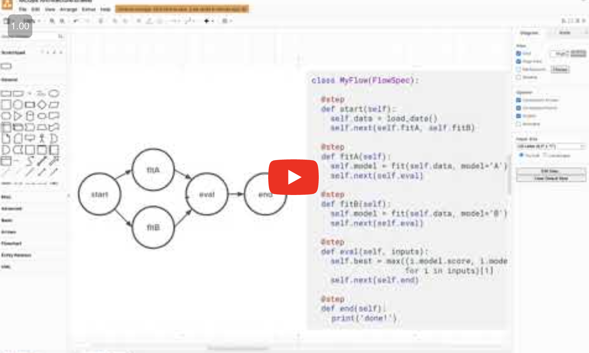
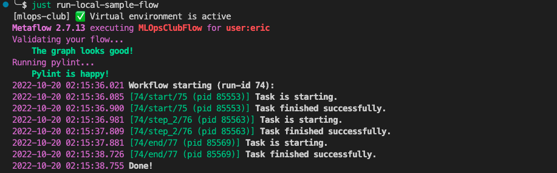

# 📣 Welcome to the MLOps Club

This repo is for our group project, trying to build an end-to-end MLOps platform.

## Project Philosophies

- This will be a fully-functional, opinionated MLOps platform.
  It should be considered a reference implementation that can be forked and adapted to a different set of opinions.
- It should be useful the average hobbyist, i.e. cheap to run, doesn't need a whole team to maintain, etc.
- BUT, this project should develop our careers, so the platform should have a straightforward way 
  to scale to small-to-medium-sized enterprise needs.
- To reduce complexity, we'll start off as a monorepo, and split off into separate repos if the monorepo becomes challenging.

## Project Kickoff video

15 minutes if you watch on 2x speed 🔥

<a href="https://youtu.be/8SLbvfX2cZY" target="_"></a>


## Contributing

The setup has only been tested for Linux and MacOS, not Windows :(.
If you're on windows, you'll have the best contributor experience using the Windows Subsystem for Linux 2 (WSL2).

### How do I run this project locally?

```
# install "just"; it's like "make", but less frustrating
brew install just

# install the project's python packages and pre-commit
just install

# start all of the metaflow services in docker-compose (don't forget to start docker first 😃)
# http://localhost:9001          -> minIO UI (simulates S3)
# http://localhost:3000          -> the Metaflow UI
# http://localhost:8080/api/doc  -> swagger API docs (currently broken when we run locally, not sure why 🤔)
just run-local-metaflow

# run a metaflow DAG (flow) against your local metaflow instance!
just run-sample-flow
```

With any luck, you'll see this lovely output:



> 📌 Go look at the `Justfile` and `docker-compose.mlops-club.yml` to see how it all works :)

### How do I add code?

We use pull requests. Create new branches based on `trunk` for experimentation, then open a PR for it.
You don't have to wait until you want to merge code to open a PR. For this project, the main purpose of doing PRs
is to share knowledge and get early feedback on your ideas.

Passing the `pre-commit` checks isn't a huge deal. They are mostly for your own benefit to prevent you
committing things to the repo that you don't want. You can always override `pre-commit` by running

```bash
git commit -m "I really want to commit this large file" --no-verify
```

#### Notes on commits

Ask Eric or Ryan if you need any help with these.

DON'T COMMIT...

- credentials. Feel free to put them in a `.env` file, but make sure it's gitignored!
- large files (large CSV, ML model weights, C binaries, video, etc.)
  use git LFS rather than committing it directly.
- unformatted code

The pre-commit hooks setup for this repo when you ran `just install` will remind you
about these each time you commit :)
