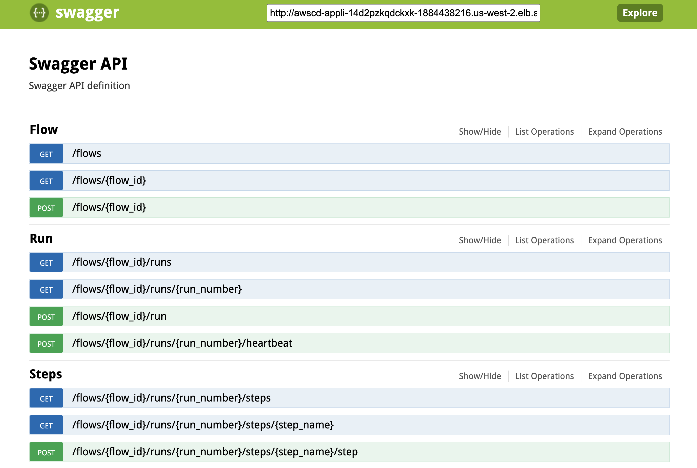

# AWS CDK Library for Metaflow

## Why CDK?

AWS CDK is AWS's modern tool for infrastructure as code. It's *soooo* much better than writing CloudFormation YAML.

Currently, there is no up-to-date CDK library for deploying Metaflow. 

We are trying to satisfy both the hobbyist's and the small-to-medium enterprise's Metaflow needs.

For this reason, we are creating a CDK library around Metaflow so that users can opt into
features that make sense for them. For example, an enterprise may want a dedicated VPC
for Metaflow to run in, whereas a hobbyist may prefer to use the default VPC because it is free.

These kinds of decisions should be supported here via parameters and useful "CDK Constructs".
Constructs are compositions of one or more AWS resources configured to solve a particular problem.
For example an `S3StaticSite` construct may create an S3 bucket, an `index.html` file inside, and
a CloudFront distribution to serve the site to the world.

## Helpful resources for Metaflow

1. [Metaflow's Architecture ↪️](https://outerbounds.com/engineering/service-architecture/)
2. [Deploying Metaflow with CloudFormation ↪️](https://outerbounds.com/engineering/deployment/aws-managed/cloudformation/)
3. [Github repo ↪️](https://github.com/Netflix/metaflow-service)for the metadata, UI, and db upgrade services. Note: one or more of these services go into the *same* docker image. I'm not sure which.

## Using CDK

```bash
# you need nodejs
brew install nodejs

# the CDK CLI is written in TypeScript
npm install -g awscdk

# "synth" this project (generate CloudFormation JSON from the Python code)
just cdk-synth
```

You'll need AWS credentials for this. You'll also need the AWS CLI to be installed. 

Reach out to Eric to get an AWS user in our MLOps Club AWS account.
Once you've set a username and password, you should be able to run `just cdk-synth` without needing
to configure an AWS profile. Refer to the `Justfile` for details 🙂.

## Learnings about Metaflow

There is a "Metaflow Metadata Service" that queries a "Metadata Database (Postgres)"
that the `metaflow` CLI uses to schedule jobs, check their status, etc.

The metadata service has a Swagger page available at `/api/doc`.

